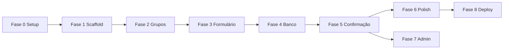

# Plano de Implementação

Desenvolvimento **simples**, fase a fase. Cada fase referencia a skill em `.cursor/skills/` a usar.

---

## Fase 0 — Preparação (sem código de negócio)

**Objetivo:** ambiente e documentação prontos.

| # | Tarefa | Entregável |
|---|--------|------------|
| 0.1 | Criar `requirements.txt` | streamlit, (sqlite3 é stdlib) |
| 0.2 | Criar `.gitignore` | `data/`, `.venv/`, `__pycache__/` |
| 0.3 | Criar `README.md` | install + run + link docs `.llm/` |

**Skill:** nenhuma (setup básico)

---

## Fase 1 — Scaffold Streamlit

**Objetivo:** app abre no navegador com layout base.

| # | Tarefa | Detalhe |
|---|--------|---------|
| 1.1 | Criar `app.py` | `st.set_page_config`, título, header CSS |
| 1.2 | Header | Faixa amarela + título (ver `design.md`) |
| 1.3 | Grid vazio | 12 placeholders "Grupo X" em `st.columns(3)` |

**Skill:** `developing-with-streamlit`
- Rodar discover: `python .cursor/skills/developing-with-streamlit/scripts/discover.py --project-dir .`
- Consultar refs de layout, theming, CSS

**Stories:** US-01, US-02, US-09 (parcial)

**Teste:** `streamlit run app.py` → 12 cards visíveis

---

## Fase 2 — Dados estáticos dos grupos

**Objetivo:** times reais da Copa 2026 nos selectboxes.

| # | Tarefa | Detalhe |
|---|--------|---------|
| 2.1 | Criar `groups.py` | `GRUPOS: dict[str, list[dict]]` |
| 2.2 | 48 times | 12 grupos × 4 times, nome + emoji bandeira |
| 2.3 | Integrar no app | Loop `for grupo, times in GRUPOS.items()` |

**Skill:** nenhuma (dados estáticos)

**Stories:** US-03

**Teste:** cada card mostra nome do grupo e lista de times disponível

---

## Fase 3 — Formulário e seleções

**Objetivo:** usuário preenche dados e escolhe 1º/2º.

| # | Tarefa | Detalhe |
|---|--------|---------|
| 3.1 | Campos pessoais | nome, telefone, email no topo |
| 3.2 | Selectboxes | 2 por grupo com `key=f"{grupo}_1"` |
| 3.3 | Validação 1º≠2º | checar antes de submit |
| 3.4 | Validação completa | todos grupos + campos obrigatórios |
| 3.5 | Session state | manter seleções entre reruns |

**Skill:** `developing-with-streamlit` (session state, forms, widgets)

**Stories:** US-06, US-07, US-08

**Teste:** preencher tudo → botão habilita; 1º=2º → erro

---

## Fase 4 — Banco de dados

**Objetivo:** persistir participações.

| # | Tarefa | Detalhe |
|---|--------|---------|
| 4.1 | Criar `database.py` | `init_db()`, `get_connection()` |
| 4.2 | Migrations inline | CREATE TABLE IF NOT EXISTS |
| 4.3 | `salvar_participacao()` | insert participante + 12 apostas (transação) |
| 4.4 | `email_existe()` | SELECT antes de insert |
| 4.5 | `listar_participantes()` | para admin |

**Skill:** nenhuma (sqlite3 stdlib)

**Stories:** US-04, US-05

**Teste:** enviar aposta → arquivo `data/bolao.db` criado; reenviar mesmo email → erro

---

## Fase 5 — Fluxo de confirmação

**Objetivo:** revisar e confirmar antes de salvar.

| # | Tarefa | Detalhe |
|---|--------|---------|
| 5.1 | Expander "Revisar aposta" | tabela 12 grupos |
| 5.2 | Botão "Participar" | chama `salvar_participacao()` |
| 5.3 | Sucesso | `st.success` + limpar session state |
| 5.4 | Erro | `st.error` para validação/duplicata |

**Stories:** US-10, US-11

**Teste:** fluxo completo end-to-end no navegador

---

## Fase 6 — Polish visual

**Objetivo:** UI próxima da referência `picture/pagina.png`.

| # | Tarefa | Detalhe |
|---|--------|---------|
| 6.1 | CSS cards | borda, sombra, padding |
| 6.2 | Estados visuais | verde=completo, vermelho=incompleto |
| 6.3 | Responsividade | columns adaptativas |
| 6.4 | Tipografia | fonte sans-serif limpa |

**Skill:** `frontend-design` + `developing-with-streamlit` (CSS)
- Direção: esportivo/utilitário, verde + amarelo, denso mas legível
- Evitar purple-gradient genérico

**Stories:** US-09 (completo)

**Teste:** visual comparado com `picture/pagina.png`

---

## Fase 7 — Admin (opcional, baixa prioridade)

**Objetivo:** ver quem participou.

| # | Tarefa | Detalhe |
|---|--------|---------|
| 7.1 | Sidebar ou tab "Admin" | `st.tabs(["Bolão", "Admin"])` |
| 7.2 | Dataframe participantes | nome, email, telefone, data |
| 7.3 | Detalhe apostas | expander por participante |

**Stories:** US-12

---

## Fase 8 — Deploy (opcional)

**Objetivo:** app acessível na internet.

| # | Tarefa | Detalhe |
|---|--------|---------|
| 8.1 | Streamlit Community Cloud | conectar repo GitHub |
| 8.2 | Persistência | SQLite no filesystem do deploy |
| 8.3 | Documentar URL | no README |

**Skill:** `developing-with-streamlit` (deploy refs)

---

## Ordem e dependências

## Estimativa (projeto educacional)

| Fase | Esforço |
|------|---------|
| 0–1 | ~1h |
| 2–3 | ~2h |
| 4–5 | ~2h |
| 6 | ~1h |
| 7–8 | ~1h opcional |
| **Total** | **~6–7h** |

## Definition of Done (projeto completo)

- [ ] App roda com `streamlit run app.py`
- [ ] 12 grupos com seleção 1º/2º funcionando
- [ ] Validações de PRD implementadas
- [ ] Dados salvos em SQLite
- [ ] UI alinhada à referência visual (simplificada)
- [ ] README documentado
